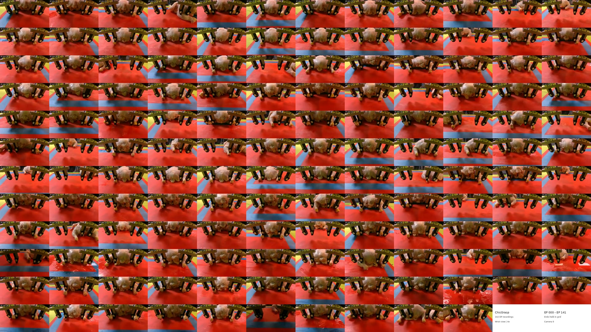

# ChicGrasp

[Portfolio](https://amirrezadavar.github.io/ChicGrasp/) · [Paper](https://doi.org/10.1002/adrr.202500149) · [Data & checkpoints](https://uark.box.com/s/c9bnzfpy6shej765x8g0z3fzt3q8ay7p) · [Videos](https://amirrezadavar.github.io/ChicGrasp/evaluations.html) · [Setup guide](docs/setup.md)

Diffusion-policy control of a customized dual-jaw gripper for delicate bio-product manipulation with a UR10e robot.

[](https://amirrezadavar.github.io/ChicGrasp/evaluations.html)

## Clone and install

```bash
git clone https://github.com/AmirrezaDavar/ChicGrasp.git
cd ChicGrasp
conda env create -f conda_environment_real.yaml -n chicgrasp_real
conda activate chicgrasp_real
python -m pip install -e .
```

## Run

Replace the example robot IP and checkpoint path with your own. Real-robot collection and evaluation require the hardware configuration in the [setup guide](docs/setup.md).

```bash
# Collect demonstrations on the robot
python demo_real_robot.py \
  --output data/demo_pusht_real --robot_ip 192.168.0.204

# Train a diffusion policy on the demonstration dataset
python train.py \
  --config-name=train_diffusion_unet_real_image_workspace \
  task.dataset_path=data/demo_pusht_real

# Evaluate a checkpoint on the robot
python eval_real_robot.py \
  --input path/to/checkpoints/latest.ckpt \
  --output data/eval_chicgrasp --robot_ip 192.168.0.204
```

Results, figures, action visualizations, and project details are on the [portfolio](https://amirrezadavar.github.io/ChicGrasp/).

[Citation](CITATION.cff) · Built on [Diffusion Policy](https://github.com/real-stanford/diffusion_policy).
