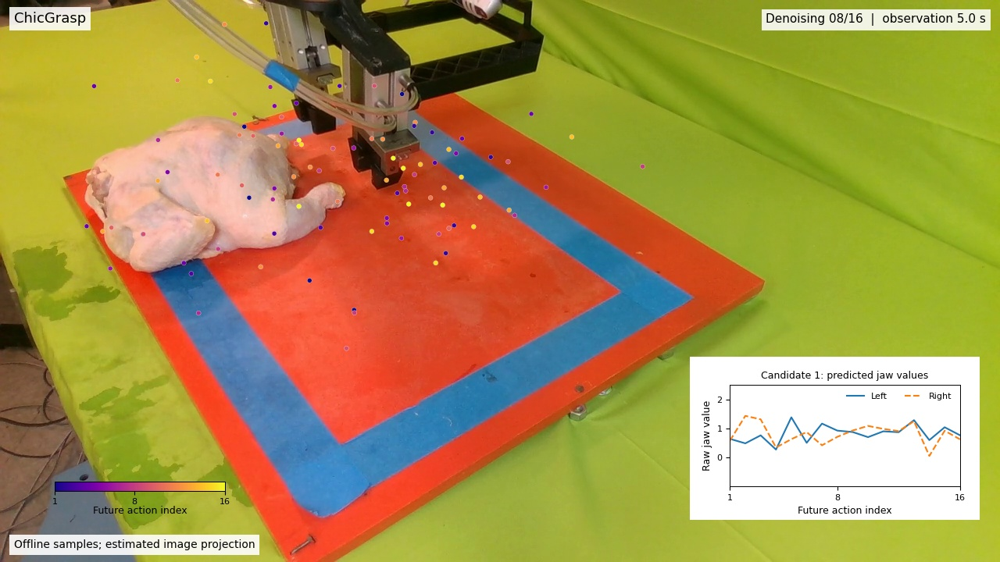
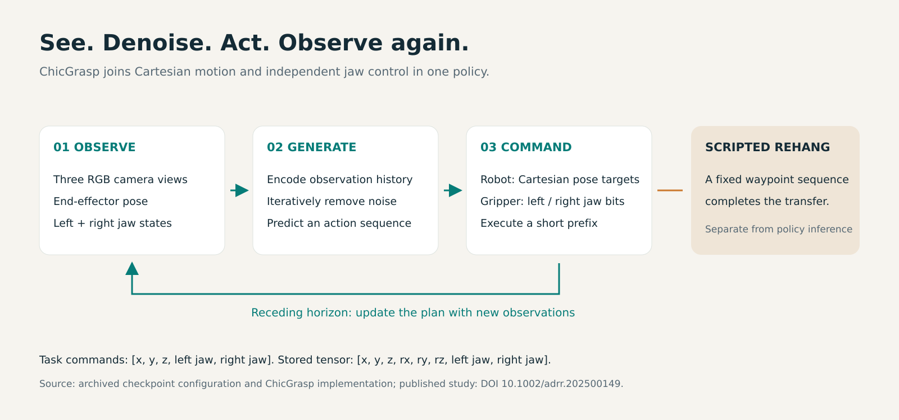
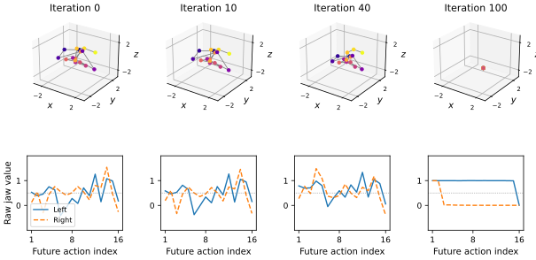
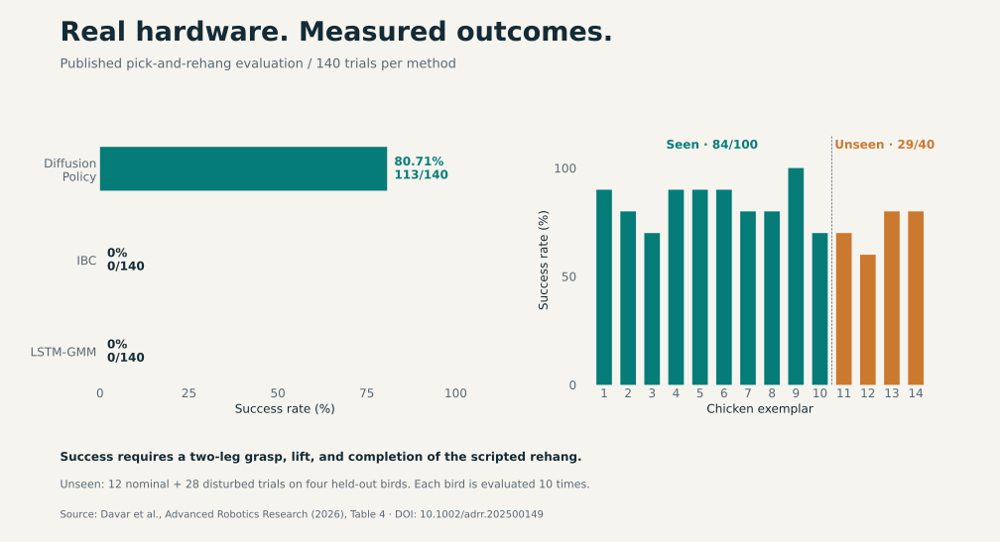
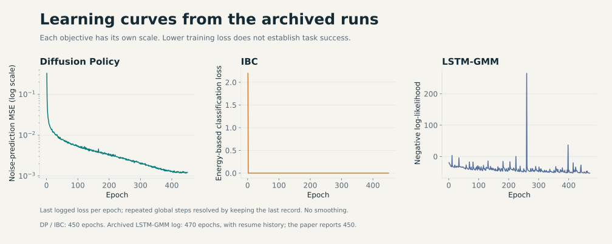
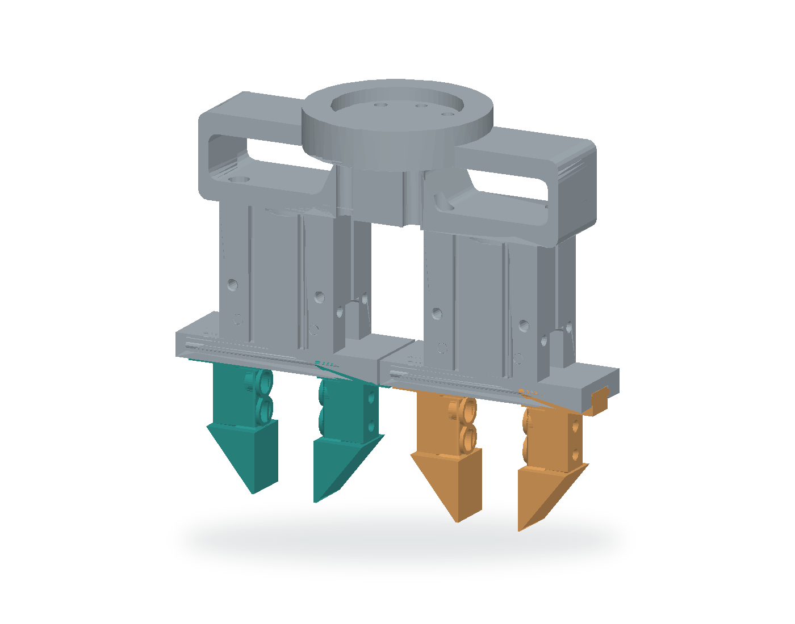
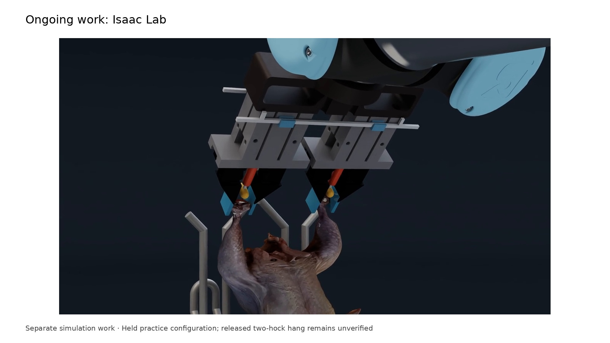

# ChicGrasp

Imitation-Learning-Based Customized Dual-Jaw Gripper Control for Manipulation of Delicate, Irregular Bio-Products

Amirreza Davar, Zhengtong Xu, Siavash Mahmoudi, Pouya Sohrabipour, Chaitanya Pallerla, Yu She, Wan Shou, Philip Glen Crandall, and Dongyi Wang. *Advanced Robotics Research*, 2026.

[Paper](https://doi.org/10.1002/adrr.202500149) · [Project page](docs/index.html) · [Data and checkpoints](https://uark.box.com/s/c9bnzfpy6shej765x8g0z3fzt3q8ay7p) · [80-second overview](docs/assets/media/chicgrasp_overview_80s.mp4)

ChicGrasp combines a customized pneumatic gripper with a diffusion policy to grasp poultry carcasses using a UR10e robot. The policy predicts robot motion and two independent jaw commands. A scripted waypoint sequence completes the rehang.

## Action generation

[](docs/assets/media/chicgrasp_action_process.mp4)

[Watch the 11-second process video](docs/assets/media/chicgrasp_action_process.mp4) · [Overlay-only version](docs/assets/media/chicgrasp_action_process_clean.mp4)

At each pause, six independent noise samples converge over 16 DDIM iterations. Color indicates future action index; the inset shows predicted jaw values for one candidate. These are actual offline checkpoint outputs. The camera overlay uses an estimated local projection, and the resumed footage is the original recording at 4× speed. The displayed plans were not executed. [Replay and projection details](docs/evidence.html#process).

## Method



The archived checkpoint uses three RGB views, end-effector pose, and both jaw states. Its stored action has eight values:

```text
[x, y, z, rx, ry, rz, left_jaw, right_jaw]
```

The paper describes five task commands: XYZ and the two jaws. The stored tensor also retains three orientation values. Jaw predictions are rounded and clipped to binary commands: **0 = closed, 1 = open**. See [paper and implementation settings](docs/evidence.html#differences).



A separate replay at the checkpoint's original 100-iteration setting shows normalized XYZ with fixed axes and raw jaw values. [Interactive explorer](docs/index.html#actions) · [Figure PDF](docs/assets/figures/diffusion_denoising.pdf) · [Final action sequence in physical units](docs/assets/figures/final_action_sequence.pdf).

## Published results

| Method | Seen carcasses | Unseen carcasses | Overall |
| --- | ---: | ---: | ---: |
| Diffusion Policy | 84/100 (84.0%) | 29/40 (72.5%) | 113/140 (80.71%) |
| IBC | 0/100 | 0/40 | 0/140 |
| LSTM-GMM | 0/100 | 0/40 | 0/140 |



The study reports 100 demonstrations and ten evaluation trials on each of fourteen carcasses per method. Success requires a two-leg grasp, lift, and completed scripted rehang. The reported successful cycle is approximately 38 seconds. These results describe a laboratory prototype handling individually presented carcasses.

Counts are transcribed from Table 4 of the paper. The supplied recordings have not been independently mapped to all published trial outcomes. An inconsistent disturbed-trial subtotal is documented in the [source notes](docs/evidence.html#results); the headline and seen/unseen totals agree with the per-carcass rows. [CSV](docs/assets/data/published_results.csv) · [Figure PDF](docs/assets/figures/published_results.pdf).

### Training curves



Last logged loss per epoch, without smoothing. The objectives have different scales and should not be ranked by loss magnitude. The LSTM-GMM archive extends to 470 epochs with resume history; the paper reports 450. [Logs and interpretation](docs/evidence.html#training) · [Figure PDF](docs/assets/figures/training_curves.pdf).

## Gripper and recorded commands



The local CAD assembly preserves the composed geometry; display colors distinguish the two jaw groups. The camera holder is omitted. [CAD provenance](docs/assets/data/cad_provenance.json).

In evaluation episode 14, the recorded right-jaw command closes at 20.6 s and the left-jaw command at 21.1 s. [Recorded robot and jaw plot](docs/assets/figures/recorded_actions.pdf) · [Numerical trace](docs/assets/data/recorded_episode.json).

### CAD files

- [Dual-jaw gripper assembly](https://cad.onshape.com/documents/59651785fc8216c351878e9e/w/96ccd4d006239148f4499ab2/e/caa066b5de7d7eefbd6d0296)
- [Jaw finger](https://cad.onshape.com/documents/f9923c0a774e494641001547/w/5449e3aa08570ad5e1bd725d/e/4c4594f9492c86e876574dad)
- [Flange](https://cad.onshape.com/documents/2ba3c05d30474bc51e5caf05/w/b2a50accccf850db7a426ca7/e/8b4a64de694fb9754597638f)
- [Camera holder](https://cad.onshape.com/documents/1ce782597a880b6af038303f/w/750def440809f62fce0fa768/e/c56676c9f0502747cf60a721)

## My contribution

I designed and fabricated the gripper, collected and integrated the demonstrations, trained the policies and baselines, and implemented the robot deployment and experimental evaluation. — Amirreza Davar

The paper credits the full research team. ChicGrasp builds on the [Diffusion Policy implementation](https://github.com/real-stanford/diffusion_policy) by Chi et al.

## Code and data

```bash
git clone https://github.com/AmirrezaDavar/ChicGrasp.git
cd ChicGrasp
conda env create -f conda_environment_real.yaml -n chicgrasp_real
conda activate chicgrasp_real
pip install -e .
```

[Setup and real-robot usage](docs/setup.md) covers collection, training, and evaluation. Hardware configuration remains machine-specific.

- [diffusion_policy/](diffusion_policy/): policies, datasets, and robot integration.
- [train.py](train.py), [demo_real_robot.py](demo_real_robot.py), and [eval_real_robot.py](eval_real_robot.py): training, collection, and deployment entry points.
- [presentation/](presentation/README.md): reproduce the tables, Matplotlib figures, and videos.
- [docs/](docs/): static project page and selected data exports.

Large files are hosted in the [data archive](https://uark.box.com/s/c9bnzfpy6shej765x8g0z3fzt3q8ay7p). The inspected snapshot contains checkpoint/log ZIPs in `training/`, state/action replay buffers in `experiments/`, evaluation recordings in `videos/`, and previous media in `Previous Stuff/`. A complete 100-demonstration training dataset was not identified in this snapshot. The [inventory](docs/assets/data/source_inventory.json) records available files.

To view the project page locally:

```bash
python -m http.server 8000 --directory docs
# Open http://localhost:8000
```

## Ongoing work: Isaac Lab

[](docs/assets/media/simulation_workbench.mp4)

A separate simulation workbench studies articulated anatomy, grasp retention, and shackle contact. The excerpt shows a held practice configuration; a repeatable released two-hock hang has not been verified. This work is separate from the published hardware study.

## Citation

```bibtex
@article{davar2026chicgrasp,
  title = {ChicGrasp: Imitation-Learning-Based Customized Dual-Jaw Gripper Control for Manipulation of Delicate, Irregular Bio-Products},
  author = {Davar, Amirreza and Xu, Zhengtong and Mahmoudi, Siavash and Sohrabipour, Pouya and Pallerla, Chaitanya and She, Yu and Shou, Wan and Crandall, Philip Glen and Wang, Dongyi},
  journal = {Advanced Robotics Research},
  year = {2026},
  pages = {e202500149},
  doi = {10.1002/adrr.202500149},
  url = {https://doi.org/10.1002/adrr.202500149}
}
```

The process video's visual approach follows the [Diffusion Policy project page](https://diffusion-policy.cs.columbia.edu/). All displayed trajectories, recordings, CAD, and results are ChicGrasp assets. The [original project video](https://www.youtube.com/watch?v=IURYkUaIiIM) is retained as project history.
