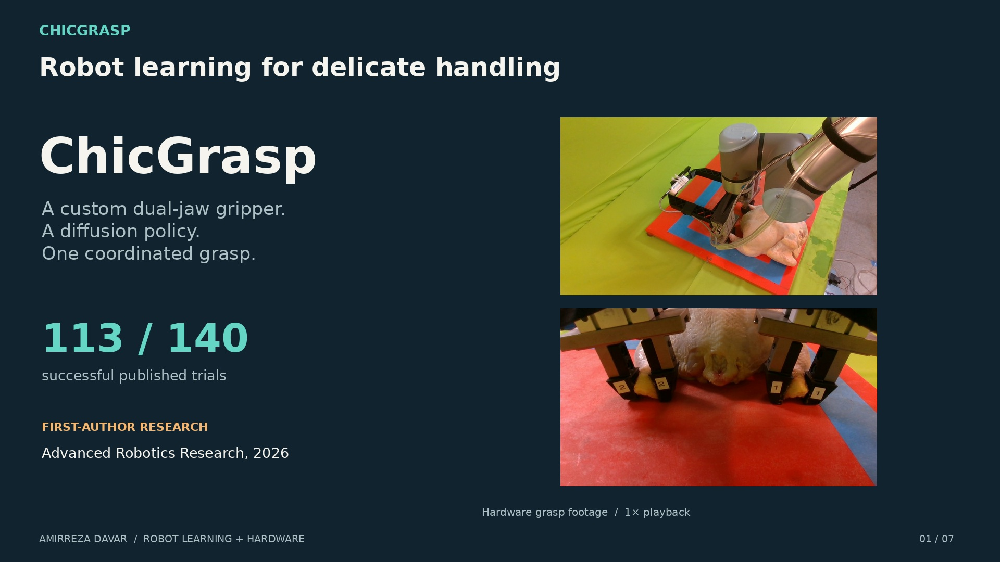
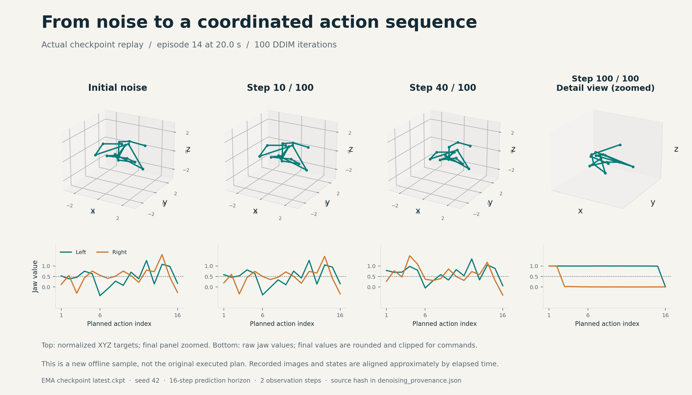
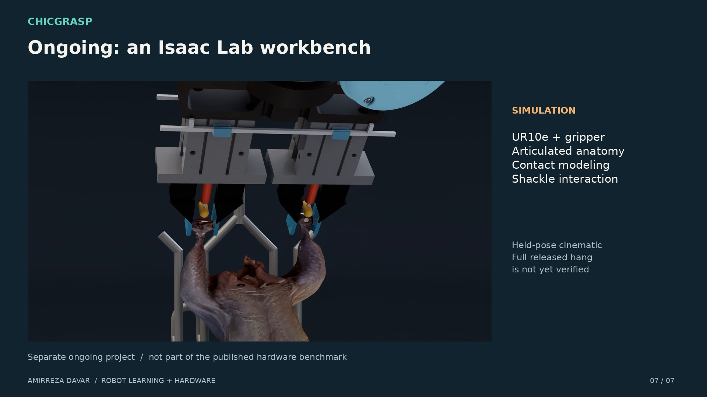

# ChicGrasp

### Robot learning for delicate, irregular handling

A **custom dual-jaw pneumatic gripper** and a **diffusion policy** coordinate a UR10e robot and two independent jaw commands to grasp poultry carcasses. A scripted transfer completes the rehang.

**[Paper](https://doi.org/10.1002/adrr.202500149)** · **[84-second film](docs/assets/media/chicgrasp_84s.mp4)** · **[Interactive project page](docs/index.html)** · **[Data & checkpoints](https://uark.box.com/s/c9bnzfpy6shej765x8g0z3fzt3q8ay7p)** · **[Reproduce the figures](presentation/README.md)**

[](docs/assets/media/chicgrasp_84s.mp4)

| Published result | Demonstrations | Task commands | Reported total cycle |
| :--- | :--- | :--- | :--- |
| **113 / 140 successes (80.71%)** | **100** teleoperated trajectories | **XYZ + two independent jaws** | **≈38 s** including scripted rehang |

*Davar et al., Advanced Robotics Research, 2026. Success requires a two-leg grasp, lift, and completed scripted rehang. These are published study results; the supplied recordings have not been independently relabeled as the paper’s full trial set.*

## What I built

I led ChicGrasp from gripper design through real-robot evaluation:

- **Hardware:** custom jaw geometry, gripper fabrication, pneumatic actuation, and robot attachment.
- **Data:** multiview teleoperation, robot and jaw logging, and observation–action dataset integration.
- **Learning:** diffusion-policy training and comparisons with IBC and LSTM-GMM.
- **Deployment:** UR10e integration, Arduino jaw commands, replay, and hardware evaluation.

**Amirreza Davar · First author.** The [paper](https://doi.org/10.1002/adrr.202500149) credits the full research team. ChicGrasp builds on the [official Diffusion Policy implementation](https://github.com/real-stanford/diffusion_policy) by Chi et al.

## How it works


1. **Observe:** collect RGB camera views, robot state, and the two jaw states.
2. **Generate:** condition a diffusion model on recent observations and iteratively refine future actions.
3. **Act:** decode robot targets and jaw commands, execute a short prefix, and update the plan with new observations.
4. **Rehang:** use a fixed waypoint sequence for transfer to the shackle.

The paper describes five task commands: `[x, y, z, left_jaw, right_jaw]`. The archived code and checkpoint store **eight values**, retaining three orientation components:

```text
[x, y, z, rx, ry, rz, left_jaw, right_jaw]
```

Jaw convention: **0 = closed, 1 = open**. Raw jaw predictions are rounded and clipped to `[0, 1]`. The supplied checkpoint conditions on three RGB views, end-effector pose, and both jaw states. See [implementation and paper differences](docs/evidence.html#differences) for exact settings.

### Watch the policy generate an action

[](docs/assets/media/diffusion_action_generation.mp4)

**[Action-generation video](docs/assets/media/diffusion_action_generation.mp4)** · **[Interactive explorer](docs/index.html#actions)** · **[Vector figure](docs/assets/figures/diffusion_denoising.svg)** · **[Provenance](docs/assets/data/denoising_provenance.json)**

The animation contains **actual intermediate model outputs**: 100 DDIM iterations from the supplied EMA checkpoint at three recorded observations. This is a new offline replay, with approximate video/state alignment. These newly sampled plans were not executed on the robot and are separate from the original command log.

### Inspect the gripper and recorded commands


**[CAD orbit](docs/assets/media/gripper_cad_orbit.mp4)** · **[Recorded robot and jaw timeline](docs/assets/figures/recorded_actions.png)**

In recorded evaluation episode 14, the right-jaw command closes at **20.6 s** and the left-jaw command at **21.1 s**. These are command transitions, not measurements of gripping force or contact.

## Published evaluation

| Method | Seen carcasses | Unseen carcasses | Overall |
| :--- | ---: | ---: | ---: |
| **Diffusion Policy** | **84 / 100 (84.0%)** | **29 / 40 (72.5%)** | **113 / 140 (80.71%)** |
| IBC | 0 / 100 | 0 / 40 | 0 / 140 |
| LSTM-GMM | 0 / 100 | 0 / 40 | 0 / 140 |


- Ten trials per carcass, fourteen carcasses per method.
- Seen: ten carcasses used during demonstration collection, evaluated under nominal conditions.
- Unseen: four held-out carcasses, with **12 nominal + 28 disturbed trials** in total.
- Reported grasp phase: approximately **28 s**. Total successful cycle including scripted rehang: approximately **38 s**.

Tables are reconstructed from **Table 4 of the paper**, with [per-chicken counts](docs/assets/data/published_results.csv) and [aggregates](docs/assets/data/published_summary.csv). One disturbed-trial subtotal in the paper is inconsistent with its rows; the [source audit](docs/evidence.html#results) records the discrepancy. The headline 113/140 and seen/unseen totals agree with the rows.

<details>
<summary><strong>Training curves and interpretation</strong></summary>


Each model optimizes a different objective, so loss magnitudes should not be compared across methods. Curves use the last logged loss per epoch without smoothing. The archived LSTM-GMM log extends to 470 epochs with resume history; the paper reports 450. See the [source audit](docs/evidence.html#training).

</details>

### Scope

ChicGrasp demonstrates learned grasping on individually presented carcasses in a laboratory prototype. Rehanging remains scripted. The reported cycle time and success rate do not establish production-line throughput or fully learned rehanging.

## Code and data

| Location | Purpose |
| :--- | :--- |
| [diffusion_policy/](diffusion_policy/) | Policies, datasets, workspaces, and real-world integration |
| [train.py](train.py) | Train a configured policy |
| [demo_real_robot.py](demo_real_robot.py) | Collect teleoperated demonstrations |
| [eval_real_robot.py](eval_real_robot.py) | Run a policy on the real system |
| [docs/](docs/) | Project page, figures, small data exports, and videos |
| [presentation/](presentation/) | Rebuild tables, plots, denoising traces, and the film |

Large files live in the existing **[ChicGrasp data archive](https://uark.box.com/s/c9bnzfpy6shej765x8g0z3fzt3q8ay7p)**. The local snapshot inspected for this presentation contains:

```text
ChicGrasp-data/
├── training/        # checkpoint_dp.zip, checkpoint_ibc.zip, checkpoint_lstm-gmm.zip
├── experiments/     # replay_buffer_{dp,ibc,lstm-gmm}.zarr.zip
├── videos/          # dp_eval/, ibc_eval/, lstm-gmm_eval/
└── Previous Stuff/  # original edited video and narration assets
```

The folder named `training/` in this snapshot contains checkpoints and logs. A complete 100-demonstration training dataset was not identified in it. The [inventory](docs/assets/data/source_inventory.json) records exactly what was available. Download from Box and retain the archive layout; this repository does not include automated download scripts.

### Installation

```bash
git clone https://github.com/AmirrezaDavar/ChicGrasp.git
cd ChicGrasp
conda env create -f conda_environment_real.yaml -n chicgrasp_real
conda activate chicgrasp_real
pip install -e .
```

See [setup and real-robot usage](docs/setup.md) for collection, training, and evaluation commands. Hardware configuration remains machine-specific. The presentation refresh does not change the controller or validate a fresh installation of all legacy dependencies.

To view the interactive page locally:

```bash
python -m http.server 8000 --directory docs
# Open http://localhost:8000
```

The page also works when `docs/index.html` is opened directly. GitHub renders this README; the interactive page can be served through GitHub Pages using `docs/`.

## CAD resources

- [Dual-jaw gripper assembly](https://cad.onshape.com/documents/59651785fc8216c351878e9e/w/96ccd4d006239148f4499ab2/e/caa066b5de7d7eefbd6d0296)
- [Jaw finger](https://cad.onshape.com/documents/f9923c0a774e494641001547/w/5449e3aa08570ad5e1bd725d/e/4c4594f9492c86e876574dad)
- [Flange](https://cad.onshape.com/documents/2ba3c05d30474bc51e5caf05/w/b2a50accccf850db7a426ca7/e/8b4a64de694fb9754597638f)
- [Camera holder](https://cad.onshape.com/documents/1ce782597a880b6af038303f/w/750def440809f62fce0fa768/e/c56676c9f0502747cf60a721)

The new CAD render uses the local USD assembly with composed geometry preserved. It omits the camera holder and adds presentation colors. [CAD provenance](docs/assets/data/cad_provenance.json).

## Ongoing work: Isaac Lab

[](docs/assets/media/simulation_workbench.mp4)

A separate simulation workbench studies articulated anatomy, grasp retention, and shackle contact. The cinematic excerpt shows a **held practice configuration**. A repeatable released two-hock hang is not yet verified. This work is separate from the published hardware evaluation.

## Citation

```bibtex
@article{davar2026chicgrasp,
  title = {ChicGrasp: Imitation-Learning-Based Customized Dual-Jaw Gripper Control for Manipulation of Delicate, Irregular Bio-Products},
  author = {Davar, Amirreza and Xu, Zhengtong and Mahmoudi, Siavash and Sohrabipour, Pouya and Pallerla, Chaitanya and She, Yu and Shou, Wan and Crandall, Philip Glen and Wang, Dongyi},
  journal = {Advanced Robotics Research},
  year = {2026},
  pages = {e202500149},
  doi = {10.1002/adrr.202500149},
  url = {https://doi.org/10.1002/adrr.202500149}
}
```

**Acknowledgment:** ChicGrasp extends [Diffusion Policy](https://github.com/real-stanford/diffusion_policy). The action-explanation layout is inspired by its [project page](https://diffusion-policy.cs.columbia.edu/); the displayed hardware, CAD, checkpoint traces, and results are ChicGrasp assets. The [original video](https://www.youtube.com/watch?v=IURYkUaIiIM) is retained as project history; its older results slide should not replace the published 2026 table.
